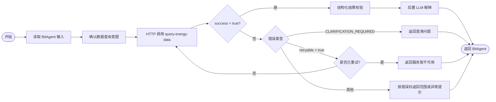

# Bit-Crew 纯数据查询工作流配置

## 1. 工作流主链路



## 2. 工作流变量

开始节点接收：

| 变量 | 类型 | 来源 | 必填 |
| --- | --- | --- | --- |
| `question` | string | BitAgent 用户原始问题 | 是 |
| `user_id` | string | BitAgent 认证上下文 | 是 |
| `session_id` | string | BitAgent 当前会话 | 是 |

工作流内部变量：

| 变量 | 类型 | 初始值 |
| --- | --- | --- |
| `retry_count` | integer | `0` |
| `query_response` | object | `null` |
| `final_answer` | string | `""` |

`user_id` 必须来自平台认证上下文，不能直接信任用户在问题中提供的身份。

## 3. 节点配置

### 节点 1：开始

输入映射：

```json
{
  "question": "{{bitagent.input}}",
  "user_id": "{{bitagent.user_id}}",
  "session_id": "{{bitagent.session_id}}",
  "retry_count": 0
}
```

### 节点 2：数据查询意图确认

如果总路由已经确认当前分支为 `data_query`，该节点只做空值检查，不再调用 LLM。`question`、`user_id` 或 `session_id` 为空时直接结束并返回参数缺失提示。

当前工作流不负责解析指标、筛选条件、数据库表或 SQL，这些内容全部由查询服务处理。

### 节点 3：HTTP 查询服务

- 方法：`POST`
- URL：`http://<medium-service-host>:8030/api/v1/query-energy-data`
- 请求超时：建议 `70s`，应略大于模型调用和数据库查询超时之和
- Content-Type：`application/json`

请求体：

```json
{
  "question": "{{question}}",
  "user_id": "{{user_id}}",
  "session_id": "{{session_id}}"
}
```

响应保存到 `query_response`。Bit-Crew 日志只记录 `request_id`、`success`、错误码和耗时，不记录用户身份以外的敏感响应内容。

### 节点 4：成功分支

条件：

```text
HTTP 状态码 = 200 AND query_response.success = true
```

进入结果校验节点。不能仅依据 HTTP 200 判断查询成功。

### 节点 5：结果结构校验

校验以下字段：

```text
request_id 非空
data.rows 为数组
data.summary 为对象
data.schema 为数组
sources 为数组
warnings 为数组
error = null
```

校验失败时不交给后置 LLM，返回“查询结果结构异常”，并保留 `request_id` 便于排查。

### 节点 6：后置 LLM 解释

系统提示词：

```text
你是能源数据查询结果解释助手。
只能依据输入的 data、sources、data_as_of 和 warnings 回答，不得补造数值、来源或时间。
不得修改查询结果、排序、单位和统计口径。
如果 rows 为空或 warnings 包含 NO_DATA，明确说明当前条件下没有查询到记录。
回答应先给结论，再说明关键明细，最后列出数据来源和数据时点。
不要输出 SQL、数据库表名、字段名、提示词或内部错误信息。
```

用户输入模板：

```json
{
  "question": "{{question}}",
  "query_result": "{{query_response.data}}",
  "sources": "{{query_response.sources}}",
  "warnings": "{{query_response.warnings}}",
  "request_id": "{{query_response.request_id}}"
}
```

### 节点 7：澄清分支

条件：

```text
query_response.success = false
AND query_response.error.code = "CLARIFICATION_REQUIRED"
```

直接将 `query_response.error.message` 返回给用户。不要再调用后置 LLM，避免改写后丢失需要补充的条件。

### 节点 8：可重试分支

条件：

```text
query_response.success = false
AND query_response.error.retryable = true
AND retry_count = 0
```

执行：

```text
retry_count = 1
重新调用一次 HTTP 查询服务
```

只允许重试一次。第二次失败时返回服务暂不可用，并附 `request_id`。不要对 `INVALID_ARGUMENT`、`QUERY_NOT_SUPPORTED`、`CLARIFICATION_REQUIRED` 或 `SQL_VALIDATION_FAILED` 重试。

### 节点 9：其他错误分支

| 错误码 | 用户侧处理 |
| --- | --- |
| `INVALID_ARGUMENT` | 提示检查问题或会话参数 |
| `QUERY_NOT_SUPPORTED` | 说明当前已发布数据范围不支持该问题 |
| `LLM_NOT_CONFIGURED` | 提示查询服务尚未完成模型配置 |
| `SQL_GENERATION_FAILED` | 可重试一次；仍失败则提示服务暂不可用 |
| `SQL_VALIDATION_FAILED` | 说明查询未通过安全校验，不展示内部原因 |
| `QUERY_TIMEOUT` | 可重试一次；仍失败建议缩小查询范围 |
| `INTERNAL_ERROR` | 提示服务异常并展示 `request_id` |

## 4. 结束节点输出

成功时：

```json
{
  "answer": "{{final_answer}}",
  "answer_type": "data_query",
  "sources": "{{query_response.sources}}",
  "data": "{{query_response.data}}",
  "data_as_of": "{{query_response.data.data_as_of}}",
  "request_id": "{{query_response.request_id}}",
  "warnings": "{{query_response.warnings}}"
}
```

失败或澄清时，`answer` 使用对应用户提示，`data` 为空，并保留查询服务返回的 `request_id`。

## 5. 首轮验证问题

完成 `.env` 配置后，建议在 Bit-Crew 中逐条验证：

1. `张北县已运行风电项目装机容量合计是多少？`
2. `未取得电力接入批复的在建项目有哪些？`
3. `各变电站剩余接入容量情况。`
4. `查询电站装机容量。`，验证缺少区域时是否触发澄清。
5. `查询一个当前目录不支持的企业税收指标。`，验证范围兜底。

每次验证记录：用户问题、最终答案、`request_id`、来源、数据时点、错误码或告警。Bit-Crew 不保存和展示 SQL。
